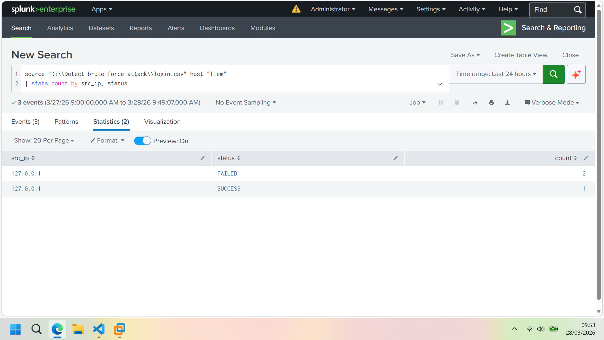
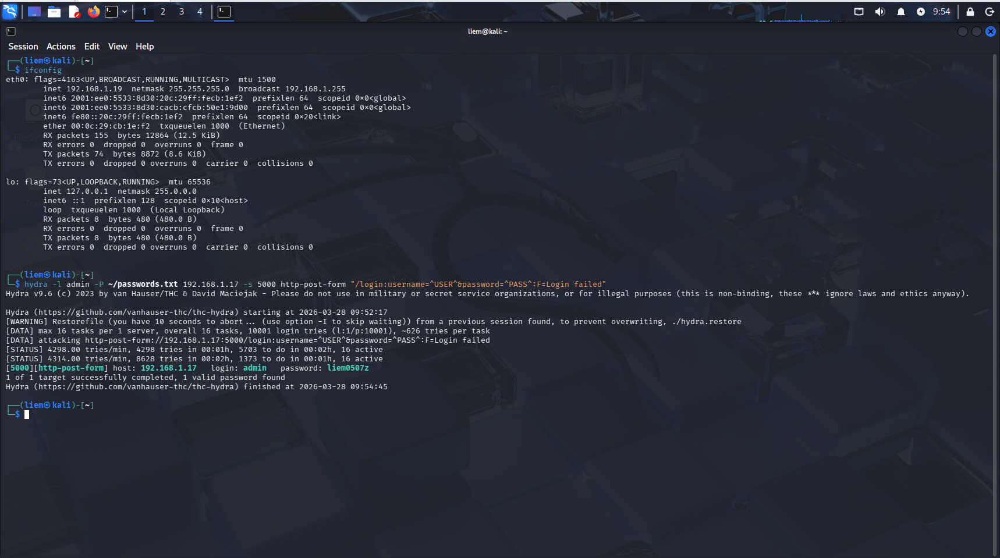
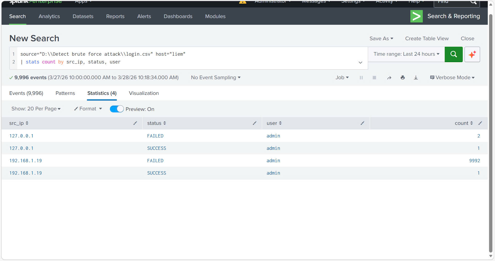
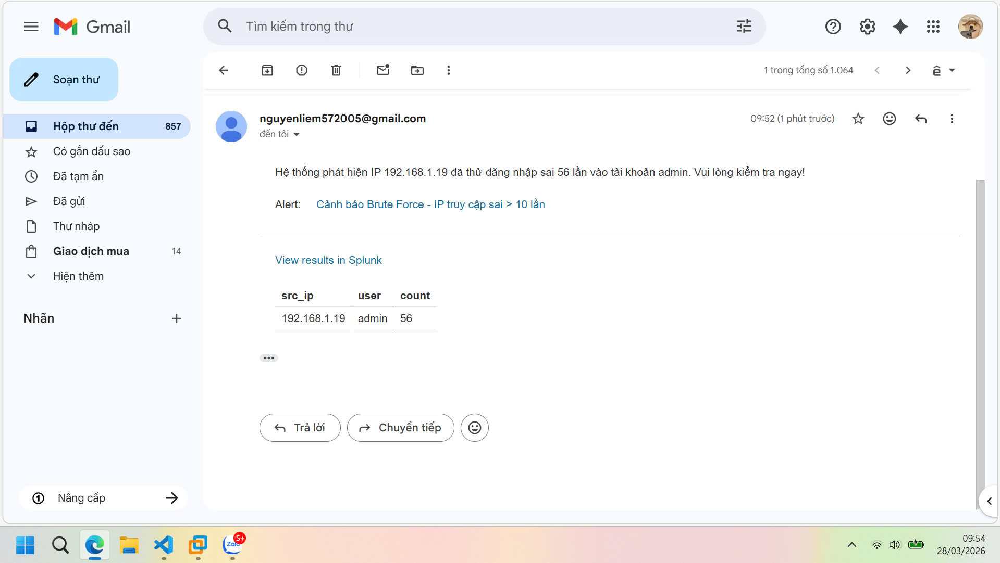

# 🛡️ Brute Force Attack Detection & Real-time Alerting System (Splunk)

This project demonstrates a complete Security Operations Center (SOC) workflow: simulating a Brute Force attack on a web application, ingesting logs into **Splunk Enterprise**, and configuring automated email alerts for incident response.

## 📋 Project Components
* **Web Application:** Built with **Flask (Python)** to simulate a login portal.
* **Database/Logging:** `login.csv` stores real-time authentication logs.
* **Monitoring & Analytics:** **Splunk Enterprise** for log parsing and behavior analysis.
* **Automation:** Automated Email Alerts triggered upon detecting malicious activity.

## 🚀 Workflow & Implementation

### 1. Data Ingestion & Field Extraction
Configured Splunk to monitor `login.csv` continuously. Used Regular Expressions (**regex**) to extract key security fields:
- `src_ip`: Attacker's IP address.
- `user`: Targeted account username.
- `status`: Login result (SUCCESS/FAILED).

### 2. Threat Hunting (SPL)
Developed a **Splunk Processing Language (SPL)** query to identify suspicious IPs attempting to crack passwords:
```splunk
source="*login.csv" status="FAILED"
| stats count by src_ip, user
| where count > 10
```
This query detects IP addresses generating more than **10 failed login attempts**, indicating a potential brute force attack.
### 3. Real-time Alerting Configuration
Set up a **Real-time Alert** with the following logic:

* **Condition**: Triggered when a single IP fails more than 10 login attempts.

* **Action**: Sends a high-priority email to the Admin with the attacker's details.

* **Throttling**: Implemented a 60-minute suppression period per IP to prevent alert fatigue (Spam protection).

## 📸 Project Screenshots
The following screenshots demonstrate the attack simulation, detection, and alerting workflow.

### 🖥️ Legitimate Admin Login


### ⚡ Brute Force Attack Simulation (Hydra)


### 🎯 Attacker IP Details


### 📧 Automated Email Notification


## 🛠️ Installation & Setup

### 1️⃣ Launch the Web Application
Run the Flask application to start the login simulation:

```bash
python app.py
```
This will start the web login portal and begin generating authentication logs in `login.csv`.

### 2️⃣ Configure Splunk Data Monitoring
Open **Splunk Enterprise**, navigate to **Settings > Data Inputs > Files & Directories**. Click **New Local File & Directory**, and select your `login.csv` file. Ensure **Continuous Monitoring** is selected so Splunk ingests logs in real-time.

### 3️⃣ Configure Email Alerts
To enable email notifications, go to **Settings > Server Settings > Email Settings**. Configure the **SMTP server** (e.g., smtp.gmail.com) and use a **Gmail App Password** for authentication.

### 4️⃣ Create the Detection Alert
Open **Search & Reporting** in Splunk, paste your SPL query, and click **Save As > Alert**. Configure the following settings:

* **Alert Type**: Real-time

* **Trigger Condition**: Per-Result

* **Throttle**: Checked (60 minutes for field src_ip)

* **Trigger Action**: Send Email (Enter your Gmail address)